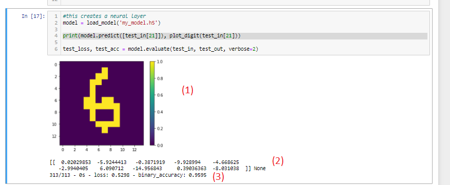

## Introduction
In this repository you can find:

- Rupert: AI model playing checkers better than humans
- Modules needed for Rupert to run properly, that is: Board.py, Engine.py, Game.py, Graphics.py, Neurals(in progress).py, Piece.py, Position.py
- archives.txt automatically saving every move to help Rupert run more efficently
- handwritten digits.ipynb, which is the independent sideproject focusing o creating a neural network distinguishing handwritten digits and 96handwriter - a trained model distinguishing digits with 96% accuracy

## Installation
In order to run this program properly, you need:
- python3 (You can install it here https://www.python.org/downloads/)
- pip(You can see how to install it here https://intellipaat.com/blog/tutorial/python-tutorial/python-pip/)
- jupyter notebook (write 'pip install notebook' in terminal and 'jupyter notebook' to find and open .ipynb files)

Libraries:
To install any of those libraries, write 'pip install {name}' 
- math
- copy
- numpy
- random
- time
- import_ipynb
- pillow
- IPython.display
- tensorflow
- tensorflow.keras.models
- keras
- keras.datasets
- matplotlib.pyplot
- pandas

## Instructions
### How to play a game against Rupert:
In order to play against Rupert, you need to run the Rupert.ipynb program
Then, an interface will appear:
<pre>

</pre>
You need to specify your move. To do so, insert four digits sperated with a space m, n, l, p:
- m and n specify the starting position of a piece You want to move
- l and p specify the ending position of a piece You want to move
- Please specify the position using y and x coordinates(in that specific order), where the upper left corner of a board has coordinates 0 0, the upper right corner - 0 9, lower left corner - 9 0, and the lower right corner - 9 9. Please note the coordinates of those points has been specified by y x notation, the same way they should be inserted.
- Should You be able to capture more than one opponent's piece and therefore do a more complex move, please specify it by insering pairs of y and x coordinates of every 'turning point', including the beginning and the end of the move

Program is set so that bot plays with white pieces by default. Should you want to play as white pieces yourself, please change the True argument to False in a game.play_human() function located at the end of the code.

The AI works with self.max_depth four to save time. Should you want to increase skills of the bot at expense of response time, please change it to six in the underlined part of the code below.

### In order to see the neural net predicting handwritten digits:
Launch the "96digits.ipynb"

You should be able to see:
- A transformed picture(1) of an arbitrary input(input nr 21 by default)
- A program's estimates regarding the number portrayed on it(2). Estimates are provided in the form of an array, where 1st number of an array corresponds to code's predictions about whether there is a 0 portrayed in a picture, the 2nd number - whether 1 is portrayed etc. You can see that for the picture nr 21 program believes the most probable choice is a digit 6(6.09), and rates the probability of it being 0 as 0.02
- accuracy of the program on a sample it has never seen before (0.9595)
